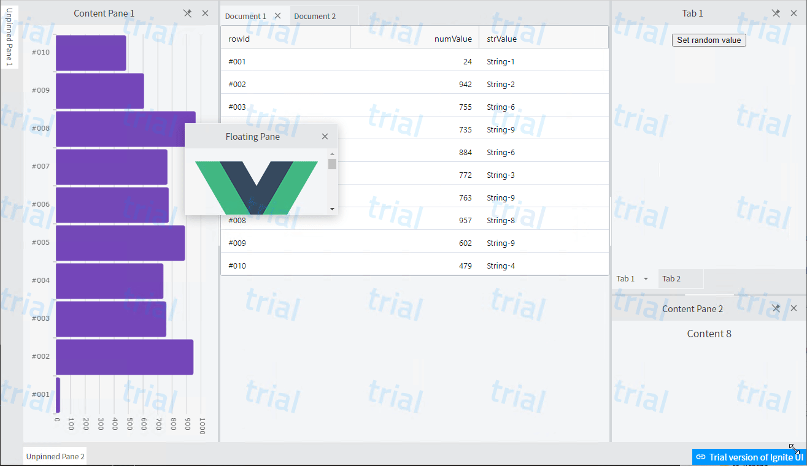

# igsample-vue-igc

Vue.jsとTypeScriptによるWebアプリの中で、[Ignite UI for Web Components](https://jp.infragistics.com/products/ignite-ui-web-components) のコンポーネントを利用するサンプルです。

## 前提条件

本サンプルを実行するにあたり、以下の環境をご用意ください。

- [Node.js](https://nodejs.org/ja/)をインストールしたローカル環境 (以下のVue.jsが対応しているバージョン / OSは問いません)
- [Vue CLI](https://cli.vuejs.org/)、TypeScriptに対応しているバージョン3以降
- Chrome、Edge Chromium (できる限り新しいバージョン)
